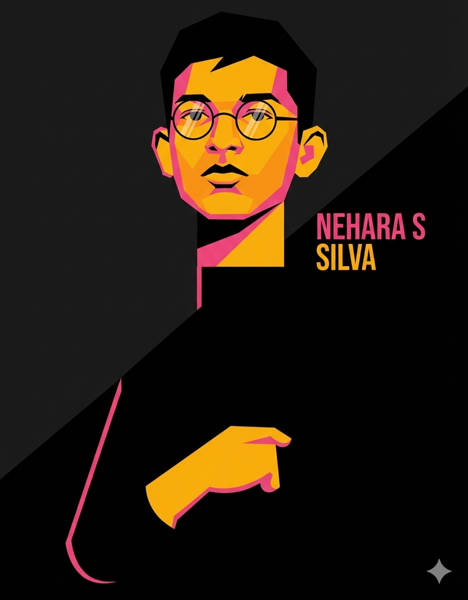

<!-- ===================== HERO ===================== -->

<div align="center">


</div>

---

<table align="center">
<tr>
<td width="38%" align="center">



<br/><br/>


</td>

<td width="62%">

## 🧑‍🚀 Who Am I?

I’m **Nehara Sandeepa Silva**, a **16-year-old Developer & Designer**  
focused on building **modern, high-performance, and visually clean digital products**.

I combine:
- ⚙️ **Engineering mindset**
- 🎨 **Strong design sense**
- 🚀 **Startup & product thinking**

to create **real-world solutions**, especially in **education & creative platforms**.

> 🟡 *Code with logic*  
> ⚫ *Design with purpose*  
> 🔥 *Build for impact*

</td>
</tr>
</table>

---

## 🧠 Tech Arsenal

<p align="center">
  
</p>

---

## 🚀 Current Mission

```txt
🌱 Learning     → Advanced Web, App & AI Systems
🔨 Building     → VORA (Next-Gen Education Platform)
🎯 Goal         → Full-Stack Developer & Creative Technologist
⚡ Mindset      → Learn • Build • Improve • Repeat
